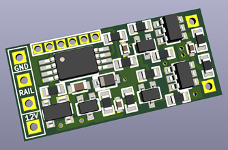
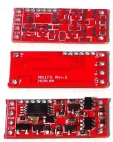

# Atmel ATtiny45 DCC Decoder PCB Data

NMRA規格の信号を受信して作動する、モーター駆動専用のDCCデコーダーのDCCデコーダの基板設計データです。

主にNゲージ鉄道模型への搭載を想定して小型に設計してあります。

主要回路についてはすべてディスクリートで構成してあるため、[回路図](docs/schematic.pdf)を参考にして、ブリッジダイオード、MOSFETなどを適宜大電流に対応可能な部品に差し替えることで、より大型のゲージに対応できるデコーダを構成できるかもしれません。

回路図、基板設計データ、面付け済みの設計データを含みます。
 面付け済みのデータについては、ガーバーデータも含みます。 (elecrowにて製造できることを確認済み)

### 主要スペック
  * 組み立て後の基板サイズ: 22mm x 10mm x 1.7mm
  * 推奨最大電圧: 16V (搭載する鉄道模型車両の最大電圧以下で使用してください)
  * 出力電流: 最大0.5A
  * コンデンサの搭載や、室内灯電源に対応する+12V / GNDのランドを用意
  * マイコン書き込み用端子を用意し、実装後のプログラム書き換えも可能 (AVR ISPのピンを1.27mmピッチで1列に伸ばしています)

### 閲覧・編集に必要なCAD (開発環境)
  * KiCad Version (5.1.6)-1 (またはそれ以降)

### 対応するファームウェア
  * [Atmel ATtiny45 DCC Decoder Firmware](https://github.com/ytsurui/dcc-motordecoder-firmware)

### 各種ドキュメント
  * [パーツリスト](docs/partslist.md)